## 30DayChartChallenge 2022

Hi, this was my first try at learning about data visualization, aside from a few matplotlib and Seaborn (Python) and d3.js (JavaScript) graphs I'd made earlier.  Encouraged and inspired by the [#30DayChartChallenge Twitter community](https://twitter.com/30DayChartChall), I experimented, had fun, and gained skills in finding data sources, differentiating the various kinds of charts, using pandas and numpy to work with the data, and writing matplotlib code.  A couple of the projects also use scipy, plotly, seaborn, holoviews bokeh, streamlit, or R.  

[Intro to the 30 Day Chart Challenge](https://github.com/30DayChartChallenge/Edition2022)

<!-- Table of Contents, literally -->

| Comparisons | Distributions | Relationships | Timeseries | Uncertainties |
|----------------------------|-------------------------|----------------------------|-----------------------------|---------------------------|
| [01 part-to-whole](#day-1) | [07 physical](#day-7)   | [13 correlation](#day-13)  | [19 global change](#day-19) | [25 trend](#day-25) |
| [02 pictogram](#day-2)     | [08 mountains](#day-8)    | [14 3-dimensional](#day-14)        | [20 new tool](#day-20)       | [26 interactive](#day-26)      |
| [03 historical](#day-3)    | [09 statistics](#day-9) | [15 multivariate](#day-15) | [21 down/upwards](#day-21)     | [27 future](#day-27) |
| [04 flora](#day-4)       | [10 experimental](#day-10)  | [16 environment](#day-16)        | [22 animation](#day-22)     | [28 deviations](#day-28)      |
| [05 slope](#day-5)         | [11 circular](#day-11)  | [17 connections](#day-17)  | [23 tiles](#day-23)         | [29 storytelling](#day-29)  |
| [06 data day: OWID](#day-6)  | [12 theme day: The Economist ](#day-12)    | [18 data day: OECD](#day-18)  | [24 theme day: Financial Times](#day-24)    | [30 data day: UN Population](#day-30)          |

# COMPARISONS

 [Day 01]: # 

### Part to Whole (Day 1) 

<a href="/day01_part_to_whole">
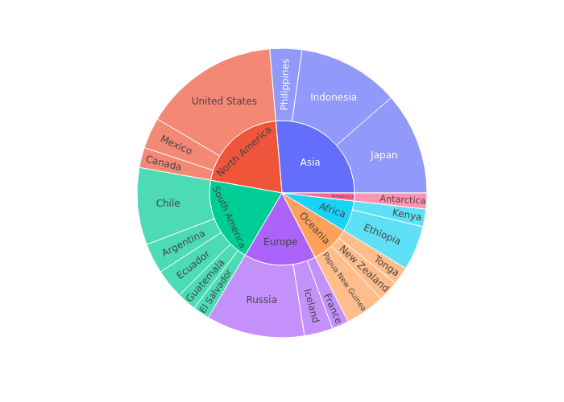</a>

Sunburst Chart - [about](https://x.com/roannav/status/1510080112275832835?s=20) - [code](/day01_part_to_whole)

 [Day 02]: # 

### Pictogram (Day 2) 

<a href="day02_pictogram">
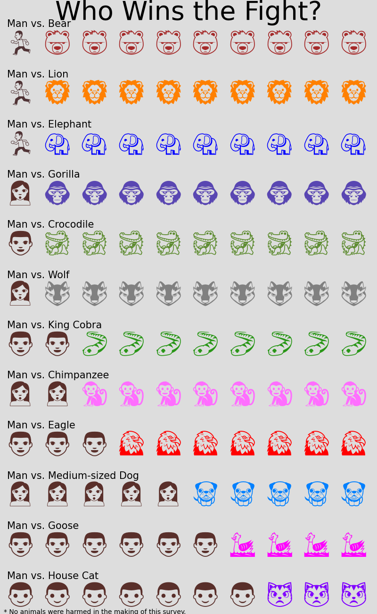</a>

Pictogram - [about](https://x.com/roannav/status/1510449517178486791?s=20) - [code](/day02_pictogram)

 [Day 03]: # 

### Historical (Day 3) 

<a href="/day03_historical">
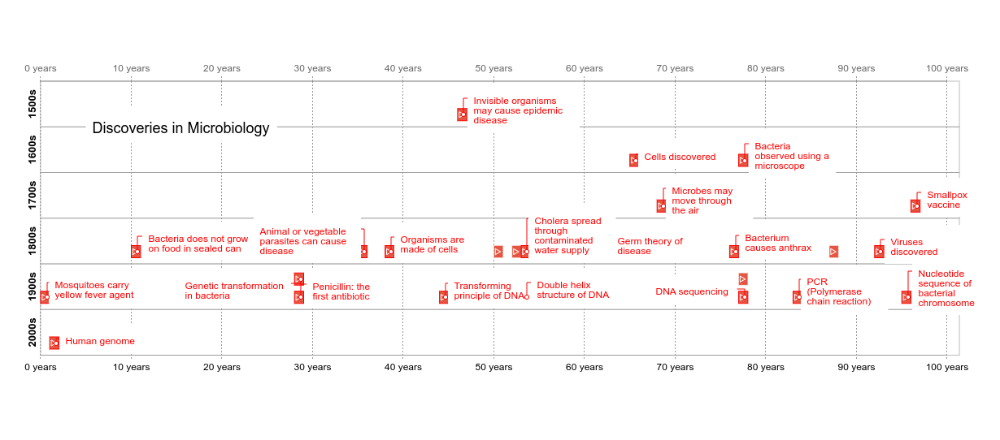</a>

Historical Timeline - [about](https://x.com/roannav/status/1510798212109520898?s=20) - [code](/day03_historical)

 [Day 04]: # 

### Flora (Day 4) 

<a href="/day04_flora">
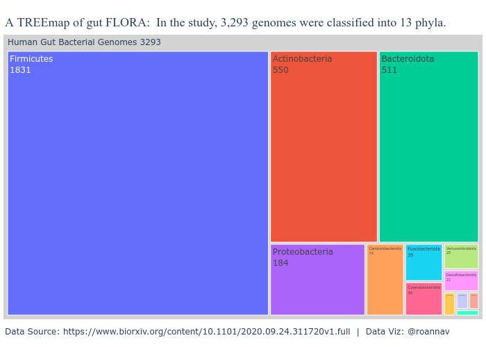</a>

Treemap - [about](https://x.com/roannav/status/1511207038323335172?s=20) - [code](/day04_flora)

 [Day 05]: # 

### Slope (Day 5) 

<a href="/day05_slope">
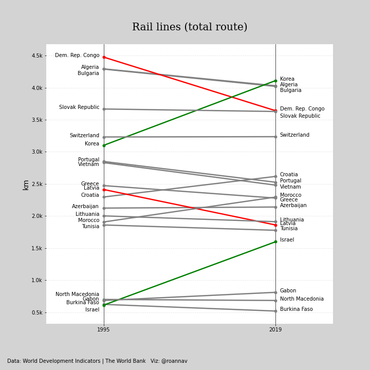</a>

Slope Chart - [about](https://x.com/roannav/status/1511543774219890699?s=20) - [code](/day05_slope)

 [Day 06]: # 

### Data OWID (Day 6) 

<a href="/day06_data_OWID">
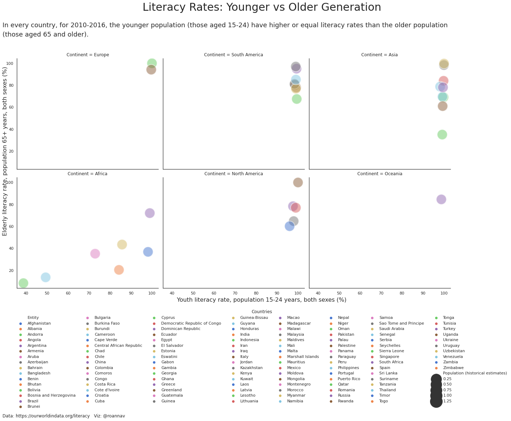</a>

Relational Plot - [about](https://x.com/roannav/status/1511875802085801986?s=20) - [code](/day06_data_OWID)

# DISTRIBUTIONS

 [Day 07]: # 

### Physical (Day 7) 

Bar Graph - [about](https://x.com/roannav/status/1512113489401110539?s=20) - [code](/day07_physical)

 [Day 08]: # 

### Mountains (Day 8) 

<a href="/day08_mountains">
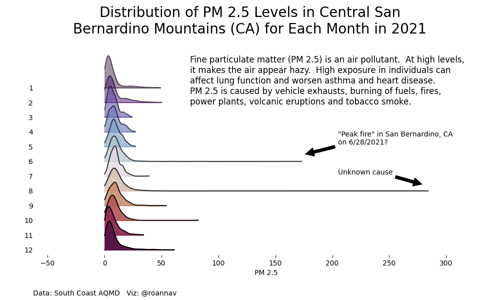</a>

Ridgeline Plot - [about](https://x.com/roannav/status/1512837432223227905?s=20) - [code](/day08_mountains)

 [Day 09]: # 

### Statistics (Day 9) 

<a href="/day09_statistics">
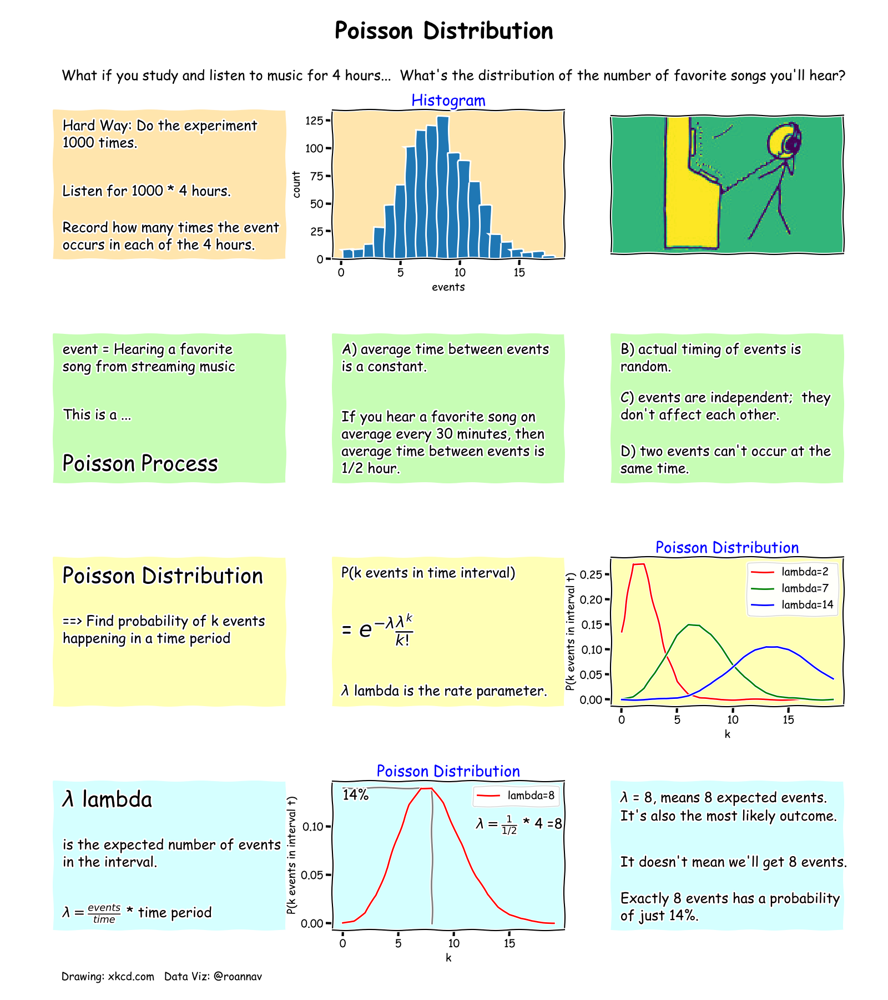</a>

Histogram, Poisson Distribution - [about](https://x.com/roannav/status/1513637933789573121?s=20) - [code](/day09_statistics)

 [Day 10]: # 

### Experimental (Day 10) 

Word Tree - [about](https://x.com/roannav/status/1513914953148690434?s=20) - [code](/day10_experimental)

 [Day 11]: # 

### Circular (Day 11) 

<a href="/day11_circular">
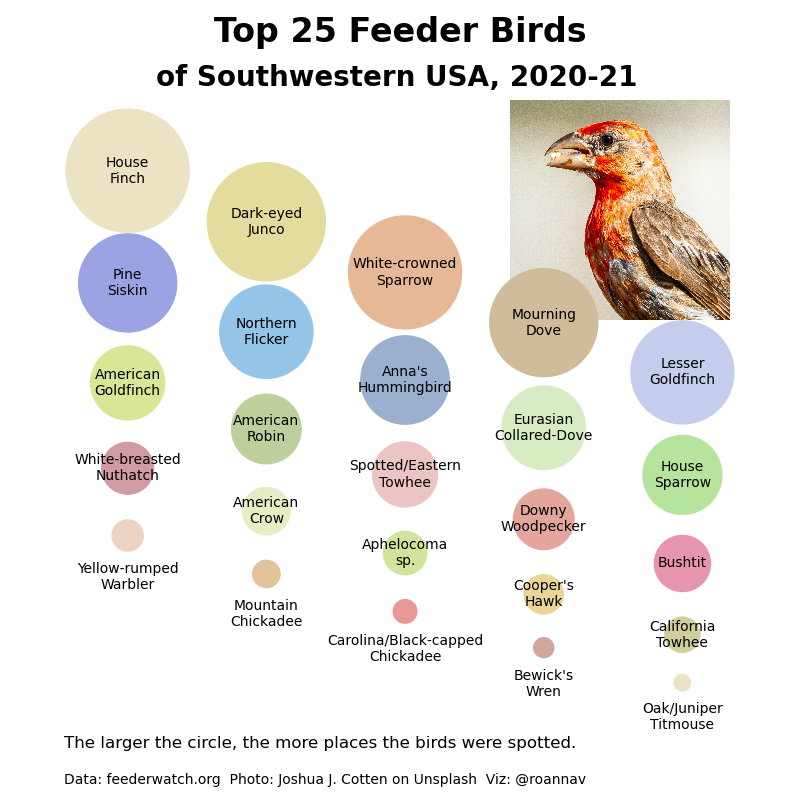</a>

Circles - [about](https://x.com/roannav/status/1520171697411805184?s=20) - [code](/day11_circular)

 [Day 12]: # 

### Theme The Economist (Day 12) 

<a href="/day12_theme_The_Economist">
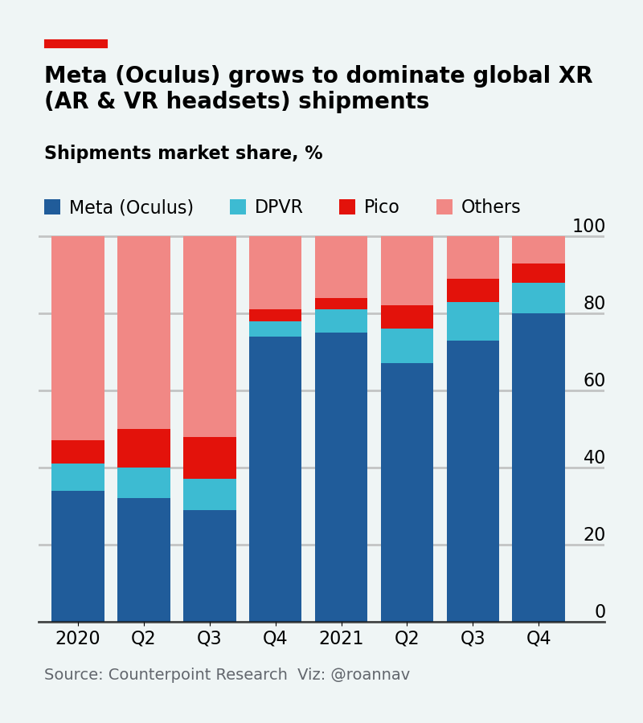</a>

Stacked Bar Chart - [about](https://x.com/roannav/status/1519770639975911424?s=20) - [code](/day12_theme_The_Economist)

# RELATIONSHIPS

 [Day 13]: # 

### Correlation (Day 13) 

<a href="/day13_correlation">
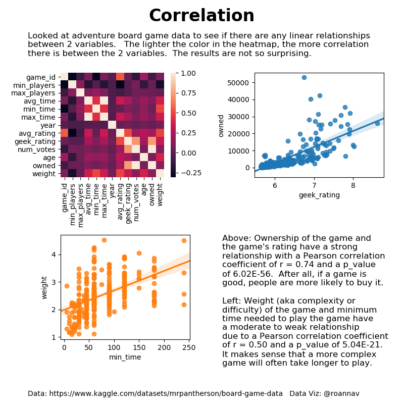</a>

Heat Map, Regression Plot - [about](https://x.com/roannav/status/1514524749887533058?s=20) - [code](/day13_correlation)

 [Day 14]: # 

### 3D (Day 14) 

<a href="/day14_3D">
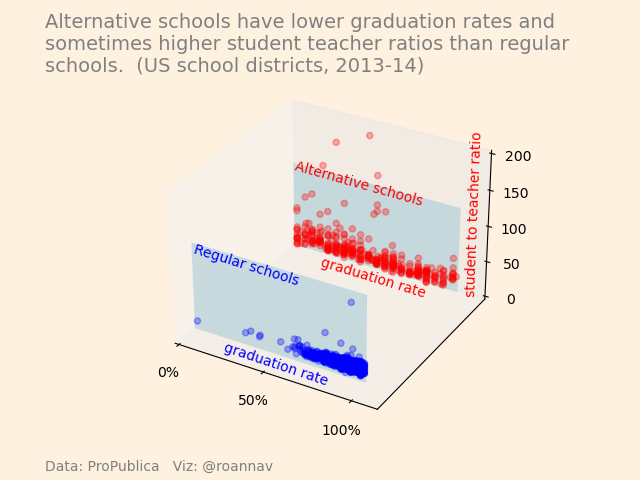</a>

Scatter Plot - [about](https://x.com/roannav/status/1520434055421997056?s=20) - [code](/day14_3D)

 [Day 15]: # 

### Multivariate (Day 15) 

<a href="/day15_multivariate">
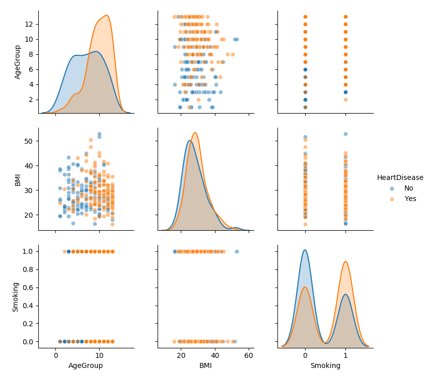</a>

Pairplot - [about](https://x.com/roannav/status/1515238627957039105?s=20) - [code](/day15_multivariate)

 [Day 16]: # 

### Environment (Day 16) 

<a href="/day16_environment">
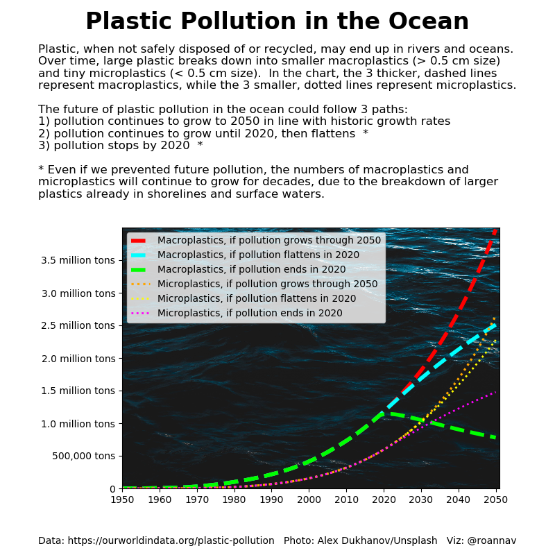</a>

Line Graph - [about](https://x.com/roannav/status/1515582102737068034?s=20) - [code](/day16_environment)

 [Day 17]: # 

### Connections (Day 17) 

<a href="/day17_connections">
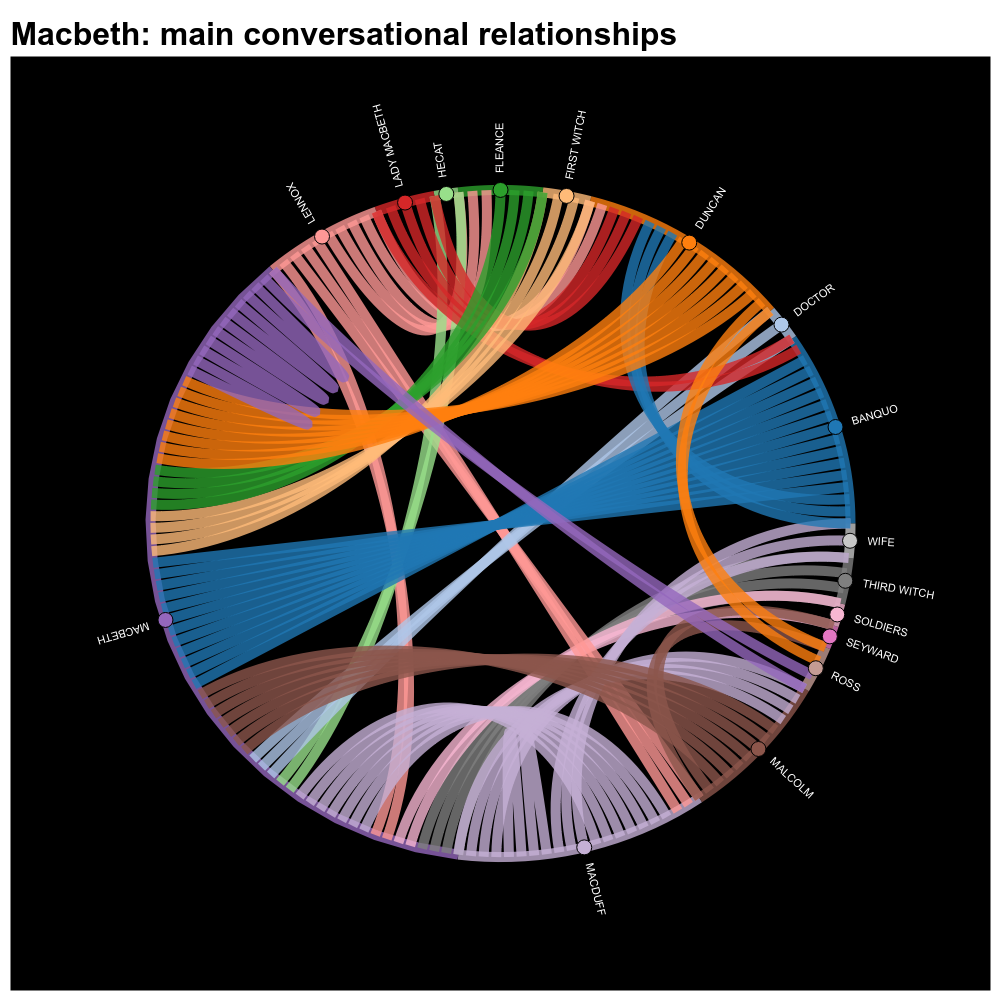</a>

Chord Diagram - [about](https://x.com/roannav/status/1516229864591749126?s=20) - [code](/day17_connections)

 [Day 18]: # 

### Data: OECD(Day 18) 

<a href="/day18_data_OECD">
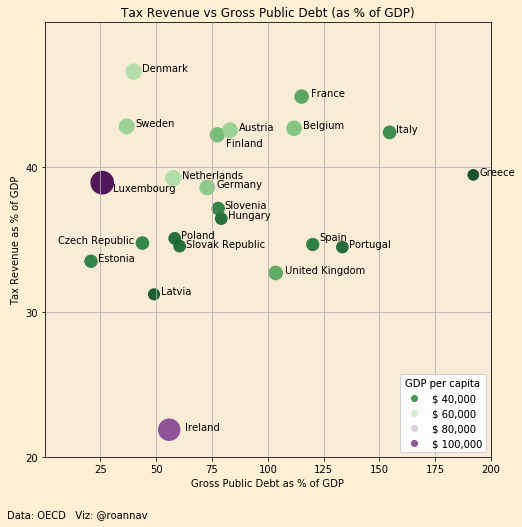</a>

Bubble Plot - [about](https://x.com/roannav/status/1516537688471400452?s=20) - [code](/day18_data_OECD)

# TIMESERIES

 [Day 19]: # 

### Global Change (Day 19) 

<a href="/day19_global_change">
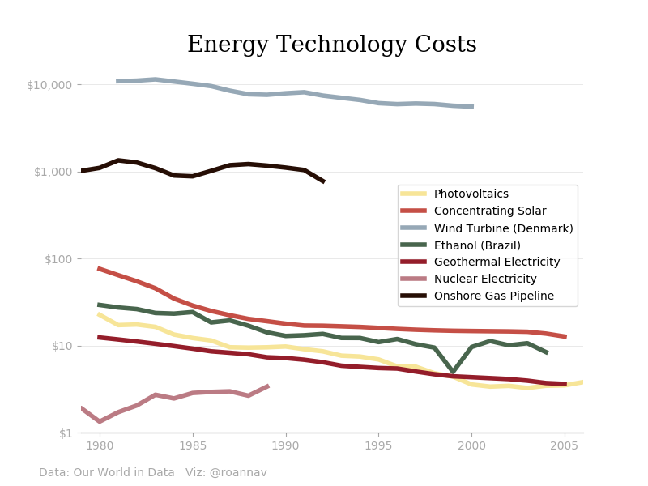</a>

Time Series Chart - [about](https://x.com/roannav/status/1516670840401661954?s=20) - [code](/day19_global_change)

 [Day 20]: # 

### New Tool (Day 20) 

<a href="/day20_new_tool">
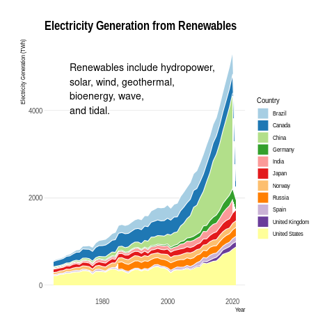</a>

Stacked Area Chart - [about](https://x.com/roannav/status/1517252735258685451?s=20) - [code](/day20_new_tool)

 [Day 21]: # 

### Down/Upwards (Day 21) 

<a href="/day21_down_upwards">
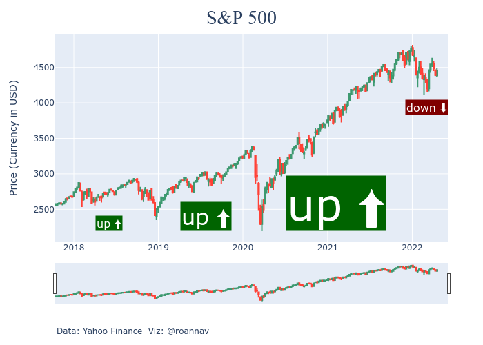</a>

Candlestick Chart - [about](https://x.com/roannav/status/1517632084642201602?s=20) - [code](/day21_down_upwards)

 [Day 22]: # 

### Animation (Day 22) 

Animated Line Graph - [about](https://x.com/roannav/status/1521689931633942528?s=20) - [code](/day22_animation)

 [Day 23]: # 

### Tiles (Day 23) 

<a href="/day23_tiles">
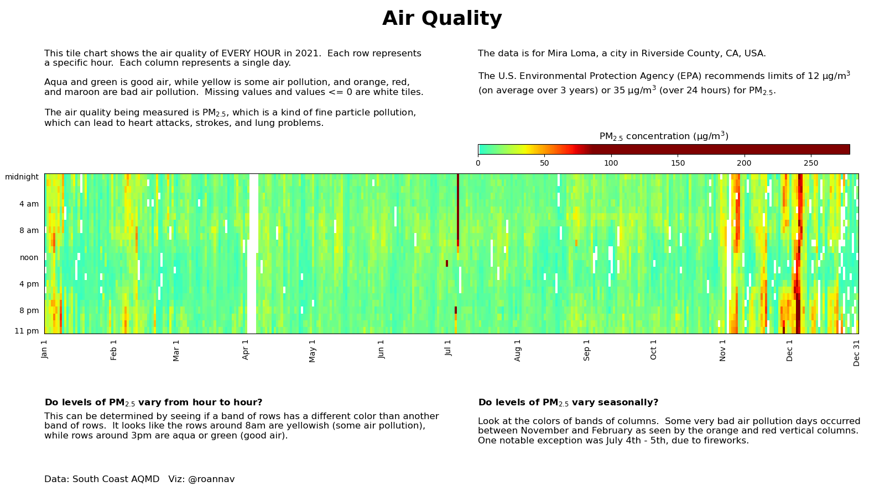</a>

Tile Map - [about](https://x.com/roannav/status/1518428291157270530?s=20) - [code](/day23_tiles)

 [Day 24]: # 

### Theme Financial Times (Day 24) 

<a href="/day24_theme_Financial_Times">
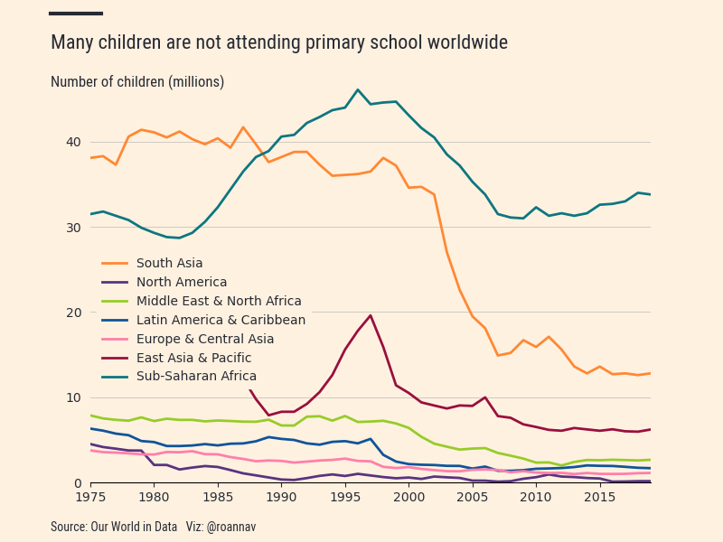</a>

Time Series Graph - [about](https://x.com/roannav/status/1518837886342246400?s=20) - [code](/day24_theme_Financial_Times)

# UNCERTAINTIES

 [Day 25]: # 

### Trend (Day 25) 

 [Day 26]: # 

### Interactive (Day 26) 

<a href="/day26_interactive">
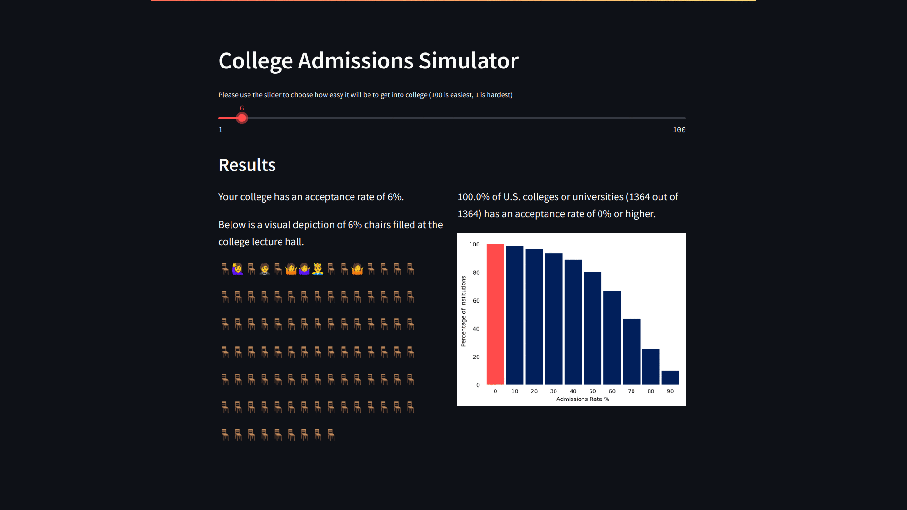</a>

Pictogram, Bar Chart - [about](https://x.com/roannav/status/1519459321507041280?s=20) - [code](/day26_interactive)

 [Day 27]: # 

### Future (Day 27) 

 [Day 28]: # 

### Deviations (Day 28) 

 [Day 29]: # 

### Storytelling (Day 29) 

 [Day 30]: # 

### Data: UN Population (Day 30) 
