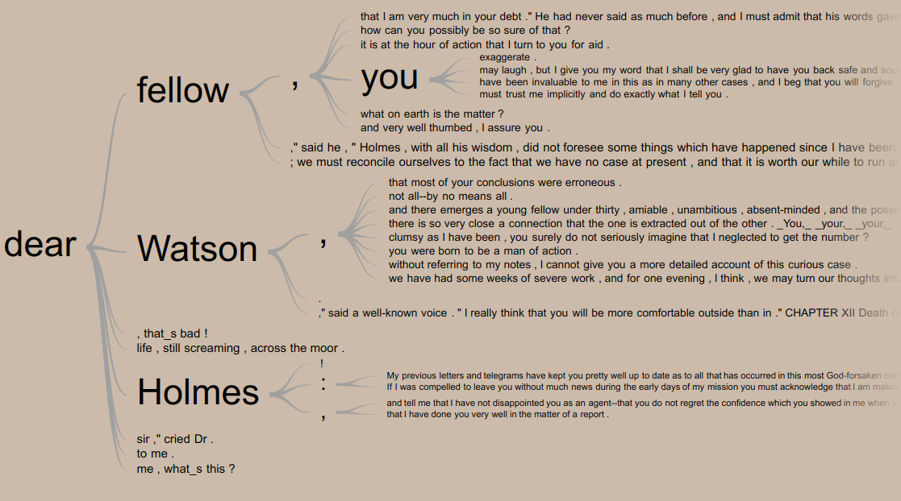

### Create an *Interactive* Word Tree of the Sherlock Holmes book _The Hound of the Baskervilles_

See the live, [interactive version]( http://roannav.github.io/30DayChartChallenge2022).

#### 30DayChartChallenge Day 10: experimental

Word Trees begin with a root word, then show which words follow and/or precede the root word.  The larger the word size, the more often the word occurs in the text.  It can analyze the given text and automatically generate this tree.

It's also possible have more explicit control over the tree's structure, word size and word color.  One idea is to set the color of a word, to provide the chart viewer additional info, such as the sentiment of the word.

Word Trees are interactive, so if you hover over a word, you'll get info about it (like the weight).  Click on a new word, to make that the root word for a newly expanded tree. 

---

This project was easy.

##### Step 1) Read about [Word Trees]( https://developers.google.com/chart/interactive/docs/gallery/wordtree), a kind of experimental Google Chart.  Try out the sample code.

##### Step 2) Find text.

Most Sherlock Holmes stories are under public domain.  I found a copy of the [full text of _The Hound of the Baskervilles_]( https://sherlock-holm.es/stories/plain-text/houn.txt) by Sir Arthur Conan Doyle.  The text file is a large 346 kB and the Word Tree was able to handle it without any problems.

##### Step 3) Pre-process the text, so it can be put into the Word Tree code.

* Remove any meta data (usually at the beginning or end of the text) that is not part of the actual story, in order to do an accurate text analysis.

* The Word Tree will hold your text in a pair of single quotes ' ',  so any single quotes in your text will need to be removed.  I just quickly substituted all single quotes with an underscore.  In vim, it's just :%s/\\\'/\_/g

* Remove the newlines. 

* Word trees are case-sensitive. If you want "Cats" and "cats" to be treated the same, use JavaScript's toLowerCase() or toUpperCase() methods on your text before providing it to the word tree.

##### Step 4) Add the text to the Word Tree html/js code, per the guide in Step 1.   

Specify what root word you want, to focus on first, from which the word tree will grow. 

##### Step 5) Open the Word Tree html in a web browser.  

